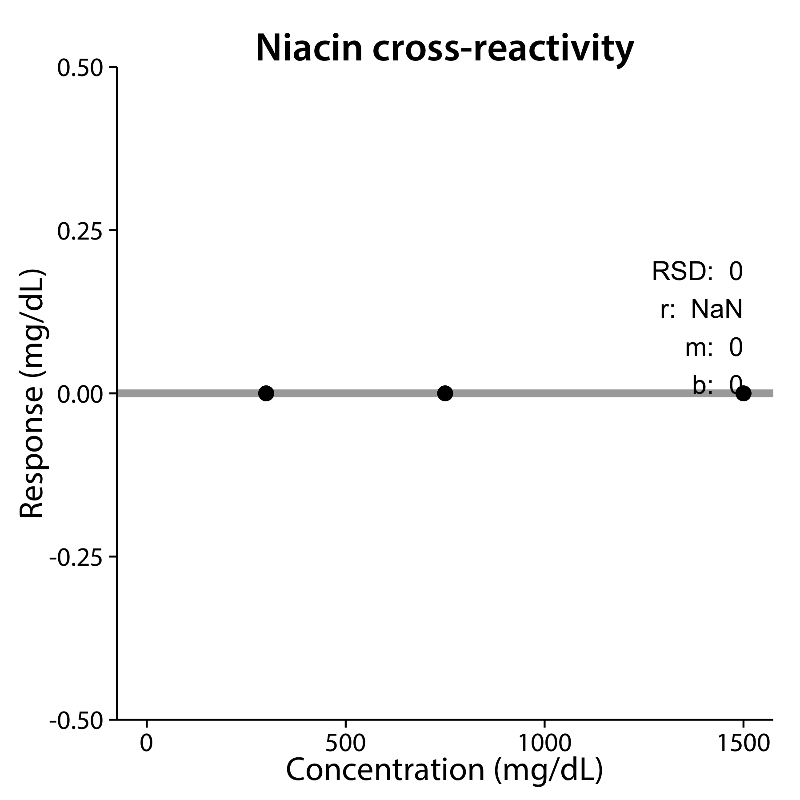

Creatinine Reverification
========================================================
This program implements calculations and plotting commands for annual reverification of creatinine screening on the Hitachi 717 automated chemistry analyzer.  
 
**Author** David Watson  
**email** [dewatson@icloud.com](mailto:dewatson@icloud.com)  
**Copyright** (c) 2014, David Watson  
  
Analysis began:

```
##------ Thu Feb 27 16:50:54 2014 ------##
```

Reverification of LoQ, ULoL
---


### Sample table

```
     Sample  ID Response
1  0005-105 0.5      0.5
2  0006-105 0.5      0.5
3  0007-105 0.5      0.5
4  0008-105 0.5      0.6
5  0009-105 0.5      0.6
6  0010-107 300    295.4
7  0011-107 300    295.9
8  0012-107 300    297.1
9  0013-107 300    293.5
10 0014-107 300    296.5
```

#### Mean, SD, and CV for each level

```
   ID   mean   SD   CV
1 0.5   0.54 0.05 10.1
2 300 295.68 1.38  0.5
```


---
Blank carryover analysis
---


**Note: the decision point for this assay is 2**


### Sample table

```
     Sample  ID Response Candidate
1  0015-108 2.0      1.9        NA
2  0016-108 2.0      1.9     FALSE
3  0017-108 2.0      2.0     FALSE
4  0018-106 0.0     -0.1        NA
5  0019-106 0.0      0.0        NA
6  0020-108 2.0      2.0      TRUE
7  0021-106 0.0      0.0        NA
8  0022-106 0.0      0.0        NA
9  0023-108 2.0      1.9      TRUE
10 0024-108 2.0      2.0     FALSE
11 0025-108 2.0      2.0     FALSE
12 0026-108 2.0      1.9     FALSE
13 0027-106 0.0      0.0        NA
14 0028-106 0.0      0.0        NA
15 0029-108 2.0      1.9      TRUE
16 0030-106 0.0     -0.1        NA
17 0031-106 0.0      0.0        NA
18 0032-108 2.0      2.0      TRUE
19 0033-106 0.0     -0.1        NA
20 0034-106 0.0      0.0        NA
21 0035-108 2.0      2.0      TRUE
```


Carryover (%):

```
0
```

CV (%) of normal decision point samples: 

```
2.8
```

An unpaired, two-sample *t*-test using unequal variance (Welch) is used to check
whether the difference in means is < 0.4 (20% of the decision point)

```

	Welch Two Sample t-test

data:  D_N and D_cc
t = -11.55, df = 8, p-value = 1.436e-06
alternative hypothesis: true difference in means is less than 0.4
95 percent confidence interval:
    -Inf 0.06442
sample estimates:
mean of x mean of y 
     1.96      1.96 
```

---
High carryover analysis
---


**Note: the decision point for this assay is 2**


### Sample table

```
     Sample   ID Response Candidate
1  0037-108  2.0      2.0        NA
2  0038-108  2.0      1.9     FALSE
3  0039-108  2.0      2.0     FALSE
4  0040-109 1000    782.2        NA
5  0041-109 1000    788.8        NA
6  0042-108  2.0      2.0      TRUE
7  0043-109 1000    783.2        NA
8  0044-109 1000    789.0        NA
9  0045-108  2.0      1.9      TRUE
10 0046-108  2.0      1.9     FALSE
11 0047-108  2.0      2.0     FALSE
12 0048-108  2.0      1.9     FALSE
13 0049-109 1000    780.9        NA
14 0050-109 1000    789.8        NA
15 0051-108  2.0      2.0      TRUE
16 0052-109 1000    785.5        NA
17 0053-109 1000    782.5        NA
18 0054-108  2.0      1.9      TRUE
19 0055-109 1000    779.6        NA
20 0056-109 1000    783.9        NA
21 0057-108  2.0      2.0      TRUE
```


Carryover (%): 

```
1
```

CV (%) of normal decision point samples:

```
2.8
```

An unpaired, two-sample *t*-test using unequal variance (Welch) is used to check whether the difference in means is < 0.4 (20% of the decision point)

```

	Welch Two Sample t-test

data:  D_cc and D_N
t = -10.97, df = 8, p-value = 2.118e-06
alternative hypothesis: true difference in means is less than 0.4
95 percent confidence interval:
    -Inf 0.08442
sample estimates:
mean of x mean of y 
     1.96      1.94 
```

---
Cross-reactivity analysis
---
### Sample Table

```
     Sample          ID Concentration Response   Analyte
1  0005-105       AA 20          20.0      5.9 ascorbate
2  0006-106       AA 50          50.0     13.1 ascorbate
3  0007-107      AA 100         100.0     27.3 ascorbate
4  0008-105       AA 20          20.0      5.9 ascorbate
5  0009-106       AA 50          50.0     13.4 ascorbate
6  0010-107      AA 100         100.0     26.7 ascorbate
7  0011-105       AA 20          20.0      6.1 ascorbate
8  0012-106       AA 50          50.0     13.1 ascorbate
9  0013-107      AA 100         100.0     27.3 ascorbate
10 0014-108  NIACIN 3.0           3.0      0.0    niacin
11 0015-109  NIACIN 7.5           7.5      0.0    niacin
12 0016-110 NIACIN 15.0          15.0      0.0    niacin
13 0017-108  NIACIN 3.0           3.0      0.0    niacin
14 0018-109  NIACIN 7.5           7.5      0.0    niacin
15 0019-110 NIACIN 15.0          15.0      0.0    niacin
16 0020-108  NIACIN 3.0           3.0      0.0    niacin
17 0021-109  NIACIN 7.5           7.5      0.0    niacin
18 0022-110 NIACIN 15.0          15.0      0.0    niacin
```

### Ascorbic acid cross-reactivity


Ascorbic acid cross-reactivity (%):

```
0.3
```

Ascorbic acid linear regression coefficients:

```
  (Intercept) Concentration 
     0.372789      0.002656 
```

 

### Niacin cross-reactivity


Niacin cross-reactivity (%):

```
0
```

Niacin linear regression coefficients:

```
  (Intercept) Concentration 
            0             0 
```

 

Analysis finished:

```
##------ Thu Feb 27 16:50:58 2014 ------##
```


